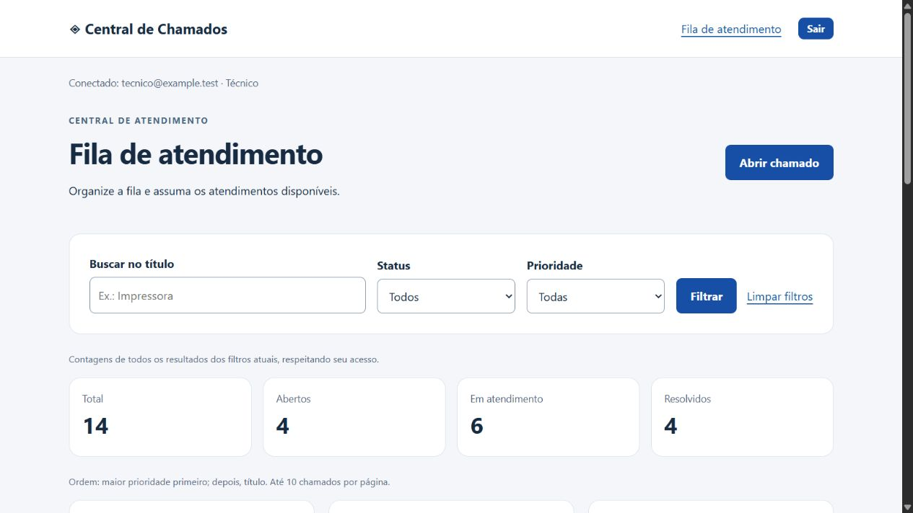

# Central de Chamados

Aplicação de estudo em **ASP.NET Core MVC, Razor Views, ASP.NET Core Identity, EF Core e SQLite**, construída em etapas para um portfólio .NET Júnior.

**Aplicação de portfólio:** prioridades, filtros, paginação, comentários e painel de contagens, com login e autorização. **87 testes aprovados**: 23 de domínio, 25 de persistência e 39 HTTP/Identity.



[Demonstração em cinco minutos](docs/DEMONSTRACAO.md) · [Perguntas de estudo](docs/ENTREVISTA.md) · [Build e testes](https://github.com/lucasferreira31/CentralChamados/actions)

## Executar

Requisito: SDK .NET 10. Na pasta deste README:

```powershell
dotnet run --project src/CentralChamados.Web -- --init
dotnet run --project src/CentralChamados.Web
```

Acesse http://localhost:5287 e crie sua conta. Todo cadastro público recebe o perfil Solicitante. Não há contas nem senhas padrão.

--init aplica as migrations e cria os perfis sem apagar registros. Execute-o ao atualizar da etapa anterior. A inicialização normal não altera o esquema.

Banco web padrão: src/CentralChamados.Web/.dados/chamados.db. Para escolher outro, defina CHAMADOS_DB com caminho absoluto antes de todos os comandos. O console usa um banco padrão separado em .dados/chamados.db na pasta de execução.

## Experimentar o perfil Técnico

Cadastre uma segunda conta pela tela. Pare o servidor e use o e-mail dessa conta:

```powershell
dotnet run --project src/CentralChamados.Web -- --promover-tecnico "tecnico@example.test"
dotnet run --project src/CentralChamados.Web
```

O endereço acima é exemplo. A promoção é administrativa e local, invalida sessões antigas e exige novo login. Não há endpoint HTTP nem opção de escolher perfil no cadastro.

## Consultas e comentários

- Prioridade Baixa, Normal, Alta ou Urgente, escolhida na abertura e fixa nesta etapa.
- Busca literal por título, diferenciando maiúsculas/minúsculas e acentos.
- Filtros combinados de status e prioridade.
- Dez registros por página, ordenados por prioridade, título e ID.
- Contagens calculadas sobre todos os resultados filtrados e autorizados.
- Comentários do solicitante e do técnico responsável, com até 2000 caracteres e registro no histórico.

Os filtros continuam na navegação entre páginas. A prioridade não representa prazo garantido; não há indicador de atraso.

Comentário não altera status nem solução. Reabrir remove o técnico atual e seu direito de comentar até assumir novamente. Outros técnicos podem consultar, mas não comentar o atendimento.

## Fluxo e autorização

Aberto → EmAtendimento → Resolvido. A resolução exige uma solução e o técnico responsável. O solicitante original pode reabrir; a atribuição e a solução atuais são limpas, preservando o histórico.

| Recurso | Solicitante | Técnico |
|---|---|---|
| Lista e detalhes | Próprios chamados | Fila geral |
| Abrir | Na própria conta | Na própria conta |
| Assumir | Não | Chamados abertos |
| Resolver | Não | Apenas quando responsável |
| Reabrir | Quando solicitante original | Quando solicitante original |

A identidade vem da sessão. IDs de autor ou solicitante enviados no formulário não alteram quem realiza a ação. Consultas de chamado alheio por solicitante retornam 404.

## Conta, persistência e histórico

Conta Identity e participante são entidades distintas, vinculadas por chave estrangeira única. Cadastro, participante e perfil são gravados numa transação. As senhas são armazenadas como hash pelo Identity.

A migration ContasEPerfis adiciona as tabelas de autenticação. Os participantes antigos não viram contas automaticamente, e cadastrar um nome igual não transfere vínculos. Os dados antigos continuam preservados; use chamados novos para experimentar integralmente o fluxo autenticado.

Estado e eventos são gravados juntos. O histórico tem sequência única por chamado e preserva o nome do autor na ação. Nomes não são usados como identidade.

## Interface e proteções

- Razor Views responsivas com validação no servidor e codificação HTML.
- Cookies HttpOnly/SameSite, sessão renovável de 30 minutos e POST para sair.
- Token antifalsificação em todos os POSTs de negócio.
- Bloqueio temporário após cinco senhas incorretas.
- Limite de 20 POSTs de login/cadastro por minuto por IP.
- Retorno após login restrito a URLs locais.
- Páginas autenticadas com no-store e erros internos sem stack trace.
- Horários do histórico exibidos em UTC.

## Organização

| Projeto | Responsabilidade |
|---|---|
| CentralChamados.Domain | Participantes, chamados, eventos e regras |
| CentralChamados.Persistence | EF Core, IdentityDbContext, migrations e transações |
| CentralChamados.Web | Controllers, cadastro, sessão, autorização e Razor Views |
| CentralChamados.BancoDemo | Demonstração persistente em console |
| CentralChamados.Demo | Demonstração em memória |
| CentralChamados.Tests | 23 testes de domínio |
| CentralChamados.Persistence.Tests | 25 testes com SQLite |
| CentralChamados.Web.Tests | 39 testes HTTP/Identity com banco temporário |

Leia o [guia da etapa 5](docs/ETAPA-5.md) e o [guia de login e perfis](docs/ETAPA-4.md), o [modelo de dados](docs/MODELO-DADOS.md) e o [roadmap](docs/ROADMAP.md). Os guias anteriores registram o comportamento das respectivas etapas.

## Testar

```powershell
dotnet test CentralChamados.slnx -c Release
```

Os testes usam cookies reais de autenticação e verificam permissões, adulteração de IDs/perfis, antifalsificação, cadastro, login, logout, bloqueio, rollback e atualização de banco antigo. Incluem também persistência, concorrência, regras do domínio, filtros combinados, contagens por escopo, paginação e comentários codificados.

## Console e migrations

```powershell
dotnet run --project src/CentralChamados.BancoDemo -- init
dotnet run --project src/CentralChamados.BancoDemo -- demo
dotnet run --project src/CentralChamados.BancoDemo -- listar
dotnet tool restore
dotnet ef migrations list --project src/CentralChamados.Persistence
```

O console é ferramenta local de estudo, sem autenticação, e não substitui a interface autorizada. BancoDemo aceita um caminho de banco após o comando; demo cria novos participantes a cada execução. Para preparar os perfis da web, use o --init do projeto Web.

## Limites atuais

Demonstração local. O perfil de desenvolvimento usa HTTP em localhost; fora de Development são habilitados HTTPS/HSTS e cookie Secure. Hospedagem, certificado, proxy, chaves e backups ainda precisam de configuração.

Ainda sem confirmação de e-mail, recuperação de senha, MFA, edição de prioridade, edição/exclusão de comentários ou anexos. O histórico de cada chamado é carregado inteiro. SQLite é o banco validado. Histórico não é inviolável contra acesso direto ao arquivo.

Código-fonte público em lucasferreira31/CentralChamados. O workflow executa build e testes em Windows e Linux a cada push e pull request; consulte a aba Actions para o resultado de cada revisão. A aplicação não está hospedada. Bancos, credenciais e arquivos de compilação não acompanham o repositório.
