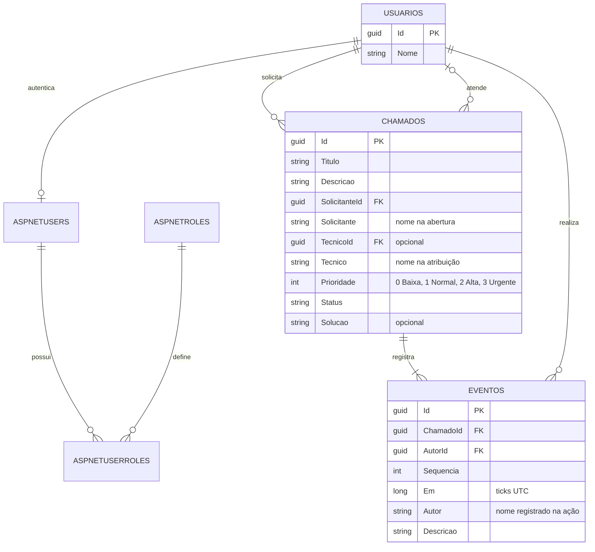

# Modelo de dados — Central de Chamados

- IDs relacionam pessoas, chamados e eventos. Nomes podem mudar e não são únicos.
- Chamado aberto não tem técnico nem solução.
- Chamado em atendimento tem técnico e não tem solução.
- Chamado resolvido tem técnico e solução obrigatória.
- Reabrir limpa a atribuição e solução atuais, mas preserva os eventos.
- ChamadoId + Sequencia é único em Eventos.
- As chaves estrangeiras impedem remover um usuário ou chamado referenciado.
- A regra de ter um evento de abertura é aplicada pelo domínio e serviço; não há uma restrição SQL exigindo pelo menos um filho.
- AspNetUsers contém a conta Identity, PasswordHash e ParticipanteId único, com chave estrangeira para Usuarios. As tabelas auxiliares de Identity armazenam perfis, claims, logins e tokens. Não há senhas em texto puro. Contas não são vinculadas automaticamente aos participantes legados.
- Prioridade aceita 0 a 3 e tem índice no banco. A migration atribui Normal aos registros antigos. Comentários são eventos com a descrição iniciada por Comentário:, preservando sequência, autor e horário.
